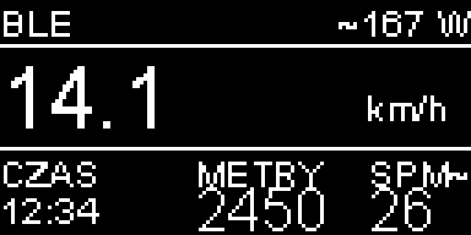

# ArduRower

## Zmiana skali w v0.07

Po obserwacji nadmiernie wysokich wskazań przy lekkim wiosłowaniu wprowadzono **wstępny współczynnik `DISTANCE_SCALE = 0.65`**. Dystans i prędkość wynoszą 65% wskazań v0.06. Moc nadal wynika z tego samego wzoru Concept2, więc wynosi około 27.5% poprzedniej wartości. Czas i wykrywanie ruchów pozostają niezależne od współczynnika.

| Wskazanie v0.06 | Wskazanie v0.07 dla tych samych impulsów |
|---|---|
| 50 m | 32.5 m |
| 20 km/h | 13 km/h, około 2:18/500 m |
| około 480 W przy 20 km/h | około 132 W |

**To przybliżenie wybrane na podstawie zgłoszonej obserwacji, nie zmierzona kalibracja względem Concept2.** Opis kondycji nie pozwala ustalić rzeczywistej mocy. Jeden czujnik ruchu taśmy bez pomiaru siły nie pozwala zapewnić zgodności wysiłku z Concept2. Współczynnik można zmienić w `ArduRower/RowerMetrics.h`; `1.0` przywraca skalę v0.06. Nie zmieniaj osobno stałej `2.8` dla watów, jeśli chcesz zachować zgodność prędkości, tempa i mocy w skali Concept2.

Komputer do wodnego ergometru wioślarskiego na **Heltec WiFi Kit 32**, z ekranem OLED 128×64 i transmisją BLE FTMS. Projekt oparty na [zpukr/ArduRower](https://github.com/zpukr/ArduRower).



## Wyświetlacz i obsługa

- Największe cyfry: prędkość w **km/h**, z jednym miejscem po przecinku.
- Góra: moc szacunkowa `~… W`; napis BLE tylko przy aktywnym połączeniu klienta. Samo reklamowanie urządzenia nie wyświetla BLE. Firmware nie identyfikuje modelu zegarka — inny połączony klient również włącza wskaźnik.
- Dół: czas aktywny, wirtualny dystans i przybliżona kadencja `SPM~`.
- Po 5 s bez impulsów zegar zatrzymuje się i pojawia się PAUZA. Pierwsze 5 s oczekiwania jest wliczane w czas. Ruch automatycznie wznawia trening.
- Krótkie naciśnięcie przycisku przełącza widok; przytrzymanie przez 1.5 s zeruje trening.
- Znak `!` oznacza utratę impulsów wskutek przepełnienia kolejki.

Urządzenie może pracować na kablu; bateria nie zajmuje miejsca na ekranie.

## Sprzęt

| Element | Połączenie |
|---|---|
| OLED SSD1306 | I²C 0x3c, SDA GPIO4, SCL GPIO15, reset GPIO16 |
| Kontaktron | GPIO2 i GND, wewnętrzny INPUT_PULLUP |
| Przycisk | GPIO0 i GND |
| Opcjonalny pomiar baterii | GPIO33, dzielnik zgodny z oryginalnym projektem |

Konfiguracja zakłada **cztery magnesy na kole taśmy uchwytu**, obracającym się w obu kierunkach. Nie jest to pomiar prędkości wirnika w zbiorniku.

## Wgranie

Otwórz `ArduRower/ArduRower.ino` w Arduino IDE. Użyj płytki **Heltec WiFi Kit 32** (pierwotna wersja ESP32, nie V3). Wszystkie lokalne biblioteki są w folderze szkicu. Zweryfikowana wersja pakietu ESP32: **3.3.2**.

Przykład kompilacji przez Arduino CLI:

```sh
arduino-cli compile --fqbn esp32:esp32:heltec_wifi_kit_32 ArduRower
```

Kompilacja i testy logiki na komputerze zostały wykonane. Nowa wersja nie była w tej sesji sprawdzona na fizycznym ergometrze ani z zegarkiem.

## Garmin i BLE

Urządzenie udostępnia usługę Fitness Machine Service i dane Rower Data, pod zachowaną nazwą `WR S4BL3`. Docelowym zegarkiem użytkownika jest Garmin fēnix 6 Pro Solar; samo połączenie Garmin Connect na telefonie nie potwierdza połączenia zegarka z ergometrem. Oryginalny projekt wskazuje pole Connect IQ [ArduRower-IQ](https://apps.garmin.com/en-US/apps/0e10bae1-9753-4915-b856-040d0cbdd82a) jako integrację Garmin. Zgodność aktualnego firmware z konkretną wersją pola wymaga próby na zegarku.

Przesyłane pola: kadencja, licznik ruchów, średnia kadencja, dystans, tempo bieżące i średnie oraz czas aktywny. Kadencja w FTMS jest kodowana w krokach 0.5 ruchu/min. Moc BLE jest domyślnie wyłączona; `SEND_EQUIVALENT_POWER = true` włącza wartości szacunkowe. Komendy FTMS Control Point nie są zaimplementowane.

## Kalibracja i granice pomiaru

Jeden kontaktron nie rozróżnia kierunku. Impulsy obejmują pociągnięcie i powrót uchwytu. Skala bazowa historycznie wynosiła **3.156 impulsu na wirtualny metr**. W v0.07 stosuje się dodatkowy współczynnik 0.65:

```
MAGNETS_PER_REVOLUTION = 4
METERS_PER_REVOLUTION = 4 / 3.156
DISTANCE_SCALE = 0.65
dystans = impulsy × METERS_PER_REVOLUTION / MAGNETS_PER_REVOLUTION × DISTANCE_SCALE
```

Nie dziel tej skali dodatkowo przez cztery ani automatycznie przez dwa. Jej bezwzględna dokładność nie jest potwierdzona. Przy porównaniu z niezależnym monitorem:

```
nowy DISTANCE_SCALE = stary DISTANCE_SCALE × dystans referencyjny / dystans ArduRower
```

Porównaj kilka dłuższych odcinków przy różnych rytmach i długościach pociągnięć. Jeśli potrzebny współczynnik zależy od sposobu wiosłowania, pojedyncza stała nie wystarczy.

Kadencja pozostaje heurystyką: wzrost częstotliwości impulsów o 500 impulsów/min i blokada 29 impulsów przy czterech magnesach. Ruch powrotny może powodować fałszywe wykrycia. Najpierw porównaj `RUCHY~` z ręcznie policzonymi 30 pełnymi cyklami. `LOG_SENSOR_PULSES = true` włącza logowanie w Serial Monitor przy 115200 baud: `P,micros,impulsy,wykryte_ruchy`.

Filtr kontaktronu wynosi 15 ms. Przy szybkich ruchach może pomijać rzeczywiste impulsy; strojenie wymaga obserwacji sygnału.

Moc `2.8 × prędkość_m/s³` jest [przeliczeniem tempa według Concept2](https://www.concept2.com/training/pace-calculator), nie zmierzoną mocą ergometru wodnego. Jednostki km/h dotyczą wyłącznie prezentacji — wewnętrzne obliczenia nadal korzystają z m/s.

## Testy

```sh
g++ -std=c++11 -I ArduRower tests/metrics_test.cpp -o metrics_test
./metrics_test
```

Testy obejmują dystans, prędkość, czas, pauzę i wznowienie, przepełnienie zegara, reset, zerowy odstęp impulsów, blokadę detektora, kadencję i uśrednianie mocy szacunkowej. Nie potwierdzają rozpoznawania prawdziwych pociągnięć. Podgląd ekranu powstał z rzeczywistych bitmap fontów, z kontrolą granic pikseli.

## Pochodzenie

Projekt bazuje na ArduRower autorstwa zpukr, wskazującym także WaterRino oraz WaterRower S4BL3. Dołączone źródła OLED pochodzą z biblioteki ThingPulse, a RunningAverage z projektu Roba Tillaarta. Zachowano informacje autorów i warunki licencyjne obecne w plikach źródłowych.
